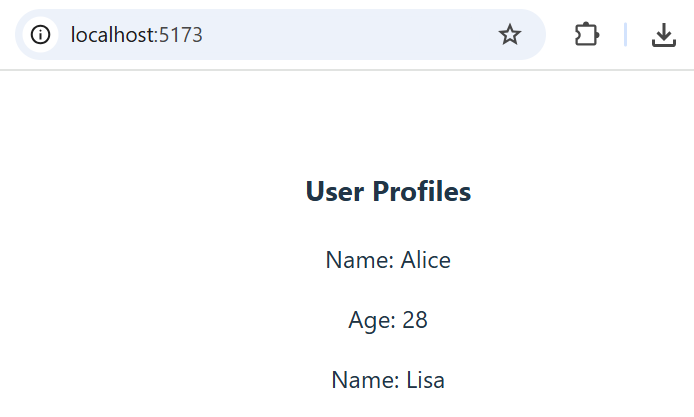

# Ehdollinen renderöinti

Käytä propseja ja tilaa (state) komponenttien ehdolliseen renderöintiin annetun boolean arvon perusteella.

### 1. Luo `ProfileCard`-komponentti
Luo React-komponentti nimeltä `ProfileCard`.

Komponentti saa seuraavat propsit:
```
name: string
age: number
showDetails: boolean
```
Komponentin toiminta:
- Näytä aina `name` props:in arvo.
- Näytä `age` arvo vain, jos `showDetails` arvo on `true`.

### 2. Näytä `ProfileCard`-komponentti
`App`-komponentti renderöi kaksi `ProfileCard`-komponenttia:
- Yksi, jossa `showDetails` arvo on `true`.
- Yksi, jossa `showDetails` arvo on `false`.

**Esimerkki tuloste:**


